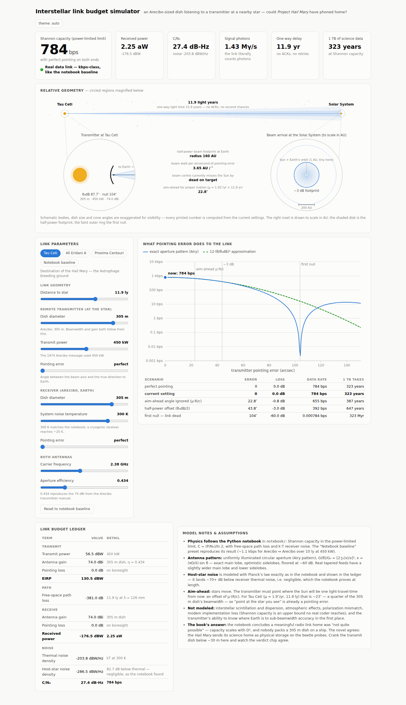
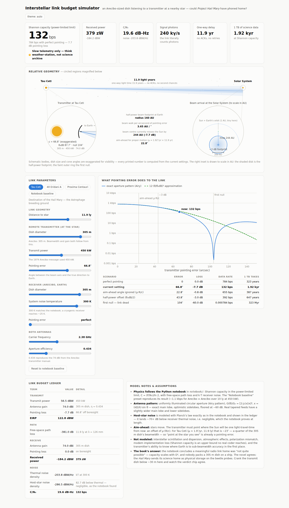

# Interstellar link budget simulator

A TypeScript web app that models an Arecibo-sized dish on Earth receiving a
signal from a transmitter at a nearby star — the *Project Hail Mary* scenario —
and shows what the link can actually carry, and how fast it dies as the
transmitter's pointing degrades.



## What it shows

- **Hero strip** — Shannon capacity with a plain-language verdict, received
  power, C/N₀, photon rate, one-way delay, and how long 1 TB of science data
  would take.
- **Relative geometry** — the transmitter star and the Solar System with the
  transmit beam cone between them, plus two magnified insets:
  - *Transmitter*: host star, dish cross-section, half-power cone, and the
    pointing error ε drawn (exaggerated) against the true direction to Earth.
  - *Beam arrival*: drawn **to scale in AU** — the half-power footprint disk,
    the first-null ring, the beam-centre miss distance, and Earth's 1 AU orbit,
    which is a dot. A 1″ pointing error walks the beam several AU at Earth.
- **Link budget ledger** — the classic dB accounting: power, gains, pointing
  losses, free-space path loss, thermal + host-star noise, C/N₀.
- **Pointing panel** — data rate vs. transmitter pointing error using the exact
  aperture (Airy) pattern against the textbook 12·(θ/θ₃dB)² approximation, with
  reference lines at the −3 dB offset, the first null (link dead), and the
  proper-motion aim-ahead angle, plus a scenario table.

Controls cover distance (with star presets: Tau Ceti, 40 Eridani, Proxima,
notebook baseline), transmitter dish diameter and power, pointing error on both
ends, receive dish, system temperature, frequency, and aperture efficiency.



## Physics

Everything follows the Python notebook in [`../notebook/`](../notebook/), with
pointing added:

| Quantity | Model |
|---|---|
| Dish gain | G = η·(πD/λ)²; η = 0.434 by default so a 305 m dish gives the 74 dBi at 2380 MHz documented in the Arecibo transmitter manual |
| Path loss | L = (4πR/λ)² |
| Off-axis gain | Airy pattern of a uniformly illuminated circular aperture, G(θ)/G₀ = [2·J₁(x)/x]², x = (πD/λ)·sin θ, floored at −60 dB (J₁ via Abramowitz & Stegun rational approximations). θ₃dB ≈ 1.029·λ/D, first null at 1.220·λ/D |
| Noise | N₀ = k·T_sys plus the host star's blackbody radio emission (Planck's law → spectral luminosity → flux at Earth → received through the dish's effective aperture). The star term lands ~70+ dB below thermal — negligible, as the notebook proved |
| Capacity | Shannon in the power-limited (infinite-bandwidth) limit: C = (P/N₀)/ln 2 — an upper bound no real modem reaches |
| Aim-ahead | The transmitter must lead the Sun's motion by μ·(R/c); for Tau Ceti that's ~23″, a quarter of a 305 m dish's beamwidth at S-band |

### Validation against the notebook

`npm test` runs 30 unit tests, including a reproduction of the notebook's
headline numbers for the 10 ly, 450 kW, Arecibo-to-Arecibo baseline:

| Quantity | Notebook | Simulator |
|---|---|---|
| Antenna gains | 74 dBi | 74.0 dBi |
| Path loss | 379.5 dB | 379.5 dB |
| Star noise PSD at receiver input | −356.6 dBW/Hz (before rx gain) | matches, and stays ≫70 dB below thermal |
| Stefan–Boltzmann sanity check | 1.26% | < 2% |
| Capacity | ~1.1 kbps | ~1110 bps |

The tests also pin the antenna pattern to ground truth: 3 dB lost at θ₃dB/2,
first sidelobe −17.6 dB, capacity ∝ D², capacity halved per 3 dB of pointing
loss.

## Development

```bash
npm install
npm run dev        # Vite dev server
npm test           # Vitest physics suite
npm run typecheck  # strict TS, no emit
npm run build      # static site in dist/
```

No runtime dependencies — plain TypeScript, hand-rolled SVG, and CSS custom
properties (light and dark themes, `prefers-color-scheme` plus a manual
toggle).

### Deploying

`npm run build` produces a fully static site in `dist/` — no server process,
no port. Assets use relative URLs (`base: './'` in `vite.config.ts`), so the
build works from the domain root or mounted under any subpath, e.g. nginx:

```nginx
location /link-budget/ {
    alias /var/www/link-budget/dist/;
    index index.html;
    try_files $uri $uri/ =404;
}
```

## Honest limitations

Not modeled: interstellar scintillation/dispersion, atmosphere, polarization,
coding overhead, ephemeris error (knowing *where* Earth is), and the tapered
illumination real feeds use (which widens the main lobe slightly and lowers the
sidelobes relative to the Airy pattern). The pattern floor at −60 dB stands in
for real far-sidelobe scatter. All of these push the answer in the same
direction the notebook already reached: the beetles were the right call.
